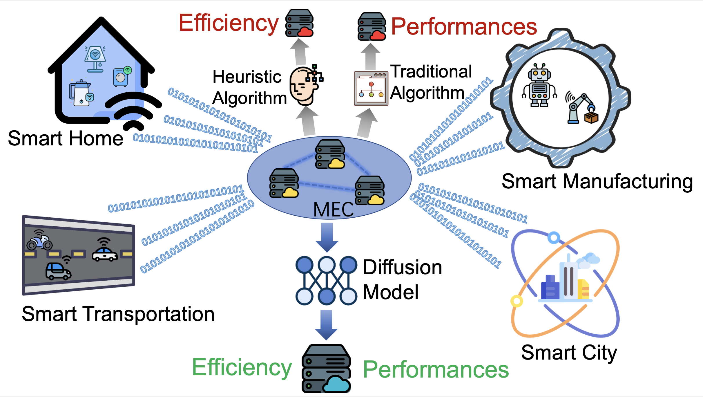
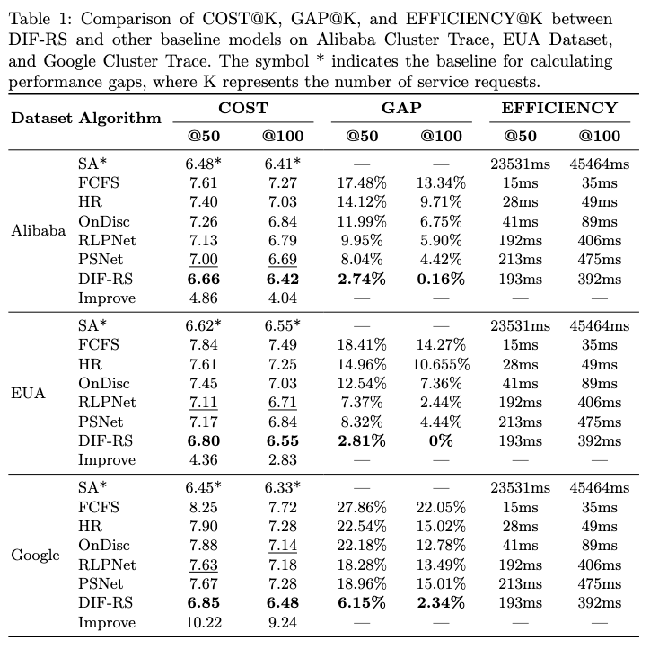

# DIF-RS

With the rapid advancement of mobile edge computing, more services are being deployed on edge servers to reduce service request latency. However, due to the limited resources of edge servers, simultaneous request arrivals often lead to task queuing, making efficient task scheduling a critical challenge. Existing heuristic-based methods perform well in scheduling problems but suffer from high computational overhead and a narrow optimization scope. To address these problems, we propose DIF-RS, a novel approach that leverages a graph-based diffusion model for multi-objective service request scheduling. DIF-RS models service requests as a graph structure with probabilistic vectors and achieves efficient inference through a few denoising steps. Extensive experiments on three real-world datasets demonstrate that DIF-RS outperforms state-of-the-art methods across multiple performance metrics. Moreover, DIF-RS achieves comparable or superior performance to heuristic algorithms while significantly reducing computational costs.



## Main Results


## Project Structure
- data: Dataaset
- dif/models: Graph encoding Netowrk
- dif/utils: Utilities
- dif/pl_edge_model.py: Training and testing method content
- dif/train.py: Training and testing method entry

## Project Setup
### Environment Installation
Make sure you have Miniconda or Anaconda installed, and then use the following commands to create the environment:
```
conda env create -f environment.yml
conda activate dif_rs
```
This file contains all the required python packages. Then, activate this environment.

This project uses Weights & Biases (WandB) for logging. You need to set WANDB_API_KEY(dif/train.py) to enable WandB:
```
export WANDB_API_KEY="your_api_key"
```

### Training and Testing
Run the following command to train:
```bash
python train.py \
  --do_train \
  --storage_path 'your_path/DIF-RS/' \
  --dataset 'alibaba_cluster_trace' \
  --task_n 50 \
  --training_split 'data/train/SA/alibaba_cluster_trace_50.txt' \
  --validation_split 'data/val/SA/alibaba_cluster_trace_50.txt' \
  --test_split 'data/test/SA/alibaba_cluster_trace_50.txt' \
  --validation_examples 4 \
  --dataset_size 1 \
  --batch_size 32 \
  --num_epochs 100 \
  --learning_rate 0.0002 \
  --weight_decay 0.0001 \
  --parallel_sampling 4 \
  --inference_diffusion_steps 2 \
  --algorithms_file_path 'your_path/DIF-RS/dif/algs'
```
If only test is desired:
```bash
python train.py \
  --do_test_only \
  --ckpt_path 'your_path/DIF-RS/models/your_ckpt_path' \
  --storage_path 'your_path/DIF-RS/' \
  --dataset 'alibaba_cluster_trace' \
  --task_n 50 \
  --training_split 'data/train/SA/alibaba_cluster_trace_50.txt' \
  --validation_split 'data/val/SA/alibaba_cluster_trace_50.txt' \
  --test_split 'data/test/SA/alibaba_cluster_trace_50.txt' \
  --validation_examples 4 \
  --dataset_size 1 \
  --batch_size 32 \
  --num_epochs 100 \
  --learning_rate 0.0002 \
  --weight_decay 0.0001 \
  --parallel_sampling 4 \
  --inference_diffusion_steps 2 \
  --algorithms_file_path 'your_path/DIF-RS/dif/algs'
```